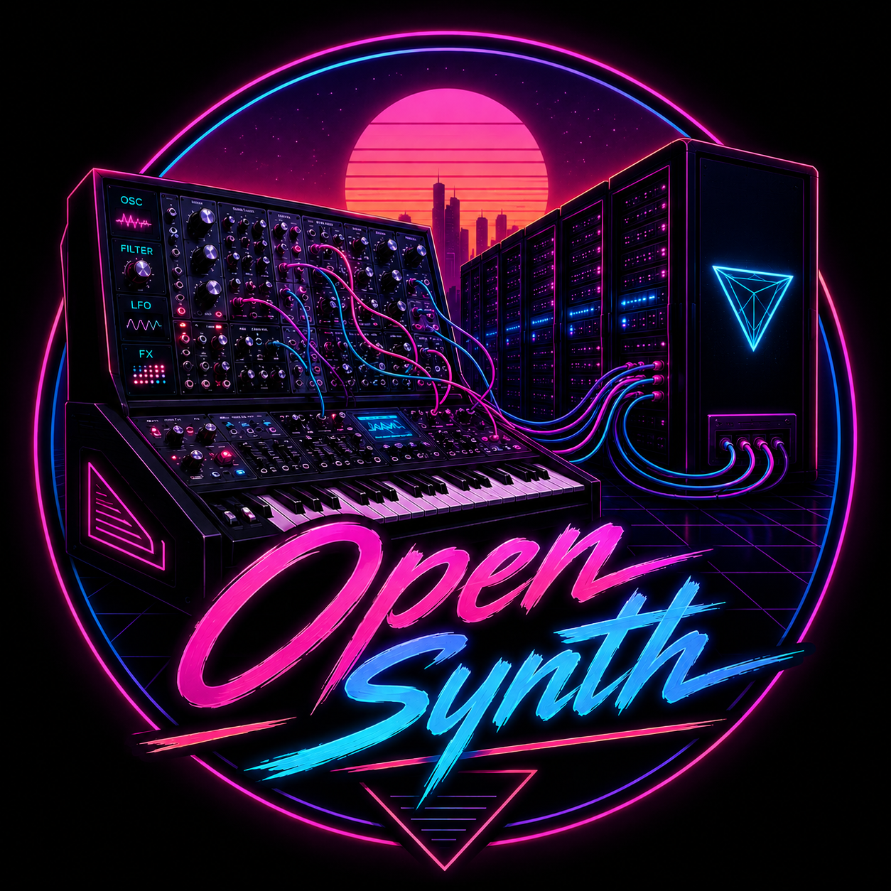

# Open Synth

A free, open-source software synthesizer built with JUCE and C++20. Inspired by the Roland Juno-Di workflow — instant playability, rich sound, zero menu diving.



## What It Is

Open Synth is a **standalone + VST3 synthesizer plugin** designed for musicians who want to plug in and play. It combines a modern C++ DSP engine with a clean JUCE-based UI, delivering everything from classic analog-style leads to evolving wavetable pads — without forcing you through nested menus.

Originally prototyped in Flutter/Dart, the engine was rebuilt in native C++ for pro audio performance: sub-10ms latency, 16-part multitimbrality, and a full MFX (multi-effects) chain.

## Features

### Sound Engine
- **Dual oscillators** per part — sine, saw, square, triangle, pulse, noise, wavetable
- **Wavetable synthesis** with 100+ built-in tables and morphing
- **Physical modeling** mode for acoustic-style realism (body resonance, key click, sympathetic strings)
- **Unison voices** with detune and stereo spread
- **FM synthesis** on both oscillators
- **Sub-oscillator** with multiple octave modes

### Filter & Envelopes
- **Multi-mode filter**: lowpass, highpass, bandpass, notch, comb
- **3 envelopes**: amp (with delay/hold), filter (with key tracking), pitch
- **Per-stage curve shaping** (linear, exponential, logarithmic)

### Modulation
- **2 LFOs** per part — tempo-syncable, fade-in, routable to pitch/filter/amp/pan
- **Pitch bend**, mod wheel, aftertouch, polyphonic aftertouch
- **Arpeggiator** with 8 patterns, octave range, swing, gate, and hold

### Effects (MFX Chain)
4-slot series effects engine with 22 processor types:

| Legacy (Slot 0) | MFX Expansion (Slots 1-3) |
|-----------------|---------------------------|
| Chorus | Equalizer |
| Delay | Limiter |
| Reverb | Rotary |
| Phaser | Tremolo |
| Flanger | Auto-Wah |
| Compressor | Bitcrusher |
| Drive | Ring Modulator |
| | Pitch Shifter |
| | Multitap Delay |
| | Ping-Pong Delay |
| | Spring Reverb |
| | Gated Reverb |
| | Amp Simulator |
| | Stereo Widener |
| | Vocoder |

### Performance & Workflow
- **16-part multitimbral** — full MIDI channel separation
- **Voice allocation**: polyphonic, monophonic, legato, unison modes
- **Drum kit** with 8 preset kits and rhythm pattern player
- **User preset manager** — save/load with categories
- **Setlist mode** — chain presets for live performance
- **MIDI learn** on all parameters
- **Audio recording** built-in
- **CPU load meter** and oscilloscope

## Architecture

```
┌─────────────────────────────────────────┐
│           JUCE Plugin Editor            │
│  (Knobs, keyboard, scope, preset UI)    │
└─────────────────────────────────────────┘
                   │
┌─────────────────────────────────────────┐
│        OpenSynthProcessor               │
│  (APVTS, MIDI routing, state mgmt)      │
└─────────────────────────────────────────┘
                   │
┌─────────────────────────────────────────┐
│        SynthEngineWrapper               │
│  (JUCE audio buffer bridge)             │
└─────────────────────────────────────────┘
                   │
┌─────────────────────────────────────────┐
│           SynthEngine                   │
│  16 parts → VoiceAllocator → FX Engine  │
│  Arpeggiator + DrumKit + Recorder       │
└─────────────────────────────────────────┘
```

## Building

### Prerequisites
- CMake 3.22+
- C++20 compiler (GCC 12+, Clang 15+, MSVC 2022+)
- [JUCE](https://github.com/juce-framework/JUCE) (cloned as sibling or set `JUCE_DIR`)

### Linux
```bash
git clone https://github.com/synthalorian/open-synth.git
cd open-synth
mkdir build && cd build
cmake .. -DCMAKE_BUILD_TYPE=Release
make -j$(nproc)
```

The standalone binary and VST3 plugin will be in `build/OpenSynth_artefacts/`.

### macOS / Windows
```bash
mkdir build && cd build
cmake .. -DCMAKE_BUILD_TYPE=Release
cmake --build . --config Release
```

## Roadmap

- [x] Core synth engine (dual osc, filter, envelopes)
- [x] Wavetable + physical modeling
- [x] Full MFX chain (22 FX types)
- [x] Arpeggiator + drum kit + rhythm patterns
- [x] 16-part multitimbrality
- [x] User presets + setlist mode
- [x] App state persistence + MIDI input
- [ ] **In Progress**: Preset library expansion (orchestral, EDM, retro)
- [ ] **In Progress**: Instrument realism system (per-category body models)
- [ ] Sample playback / ROMpler layer
- [ ] MPE (MIDI Polyphonic Expression) support
- [ ] CLAP plugin format
- [ ] iOS / Android standalone apps

## License

MIT License — see [LICENSE](LICENSE).

## Credits

Built by [synthalorian](https://github.com/synthalorian) with the JUCE framework.

---

*"This is the wave."* 🎹🦈
